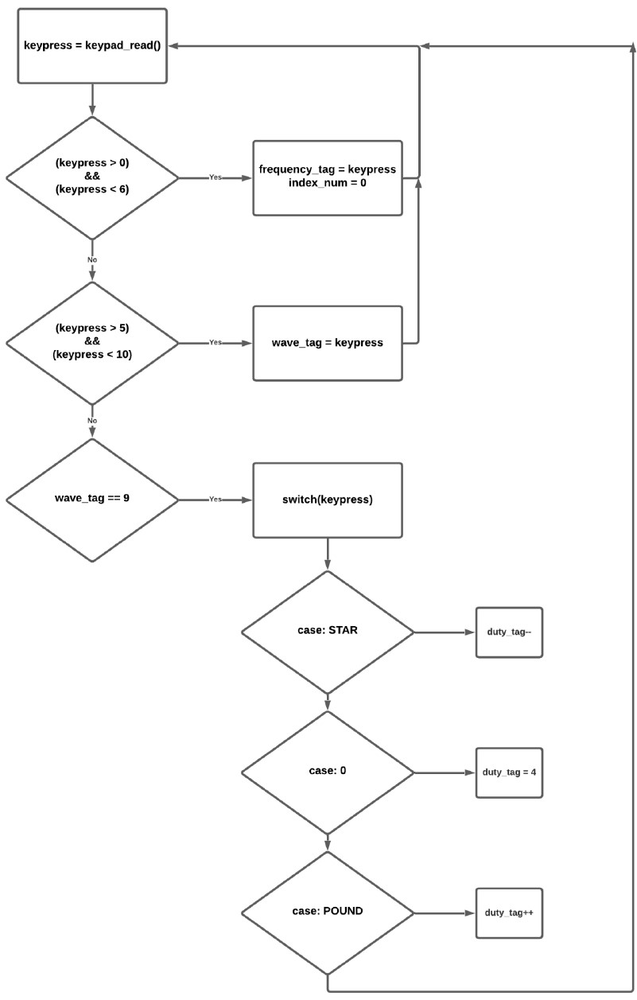
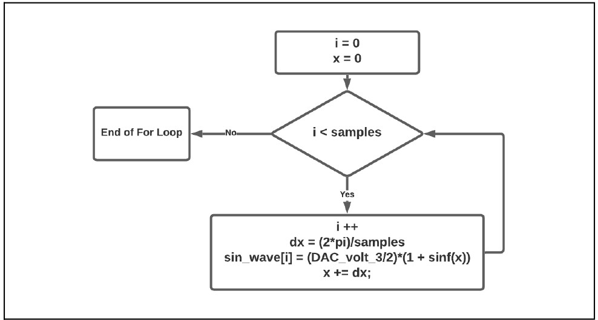
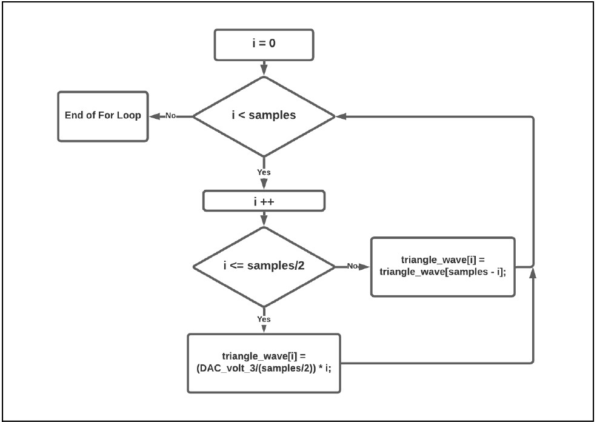
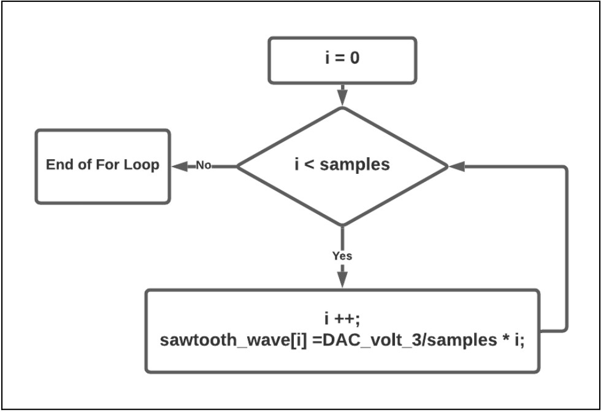
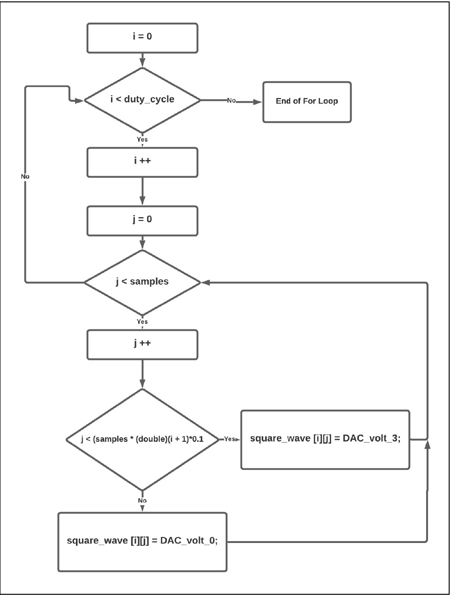
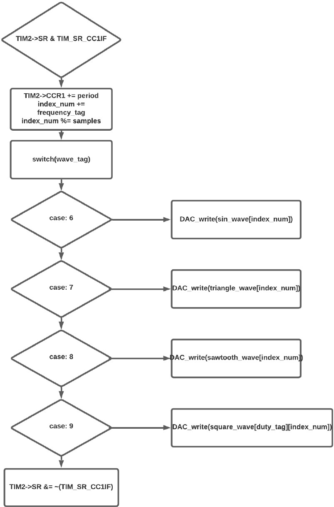

# Software Architecture
## Calculations - Interrupt Period & Max Resolution:<br />

```
ISR_exe = 2.115us (68 clock cycle)
ISR_Start = 0.75us (92-68 = 24 clock cycle)
ISR_Total = 2.865us

Points \ Waveform = (10ms*100khz) \ 2.865us
                  = 1960 points
To make the amount of points can be divided by 3,4,5 
                  => 1800 points
                  
ISR_Total = 10ms / 1800 points = 5.555us
Clock Cycle = 5.55us * 32 Mhz
            = 177.778 clock cycle
            = 178 (CCR1)
```

| ISR Execute Time(ISR_exe) | 2.115us|
| :-----------:  | :-----------: |
| ISR Start Time(ISR_start)| 0.75us |
| ISR Total Time(ISR_tol) |2.865us|
| Maximum Resolution | 1960 samples/ 100Hz_wave |
|Ideal Resolution (Can be divided by 3, 4, and 5)| 1800 samples/ 100Hz_wave |
| Ideal ISR Total Time| 5.555us |
| Ideal Clock Cycle |178 clock cycle|


## Flowchart:<br />
* While Loop:<br />
The structure of the while loop in the main function is made up of three if statements, the three if statements are used to detect which key has been pressed on the keypad. Based on the key being pressed, the function will adjust the global tags of the waveform, frequency, and duty cycles. Through adjusting these tags, the function, TIM2_IRQHandler(), can tell which look-up table it should take the data from and also what frequency and duty cycle should be set.<br />
<p align="center">
  
</p>

* Lookup Table:<br />
  * Sin Wave:<br />
We used the built-in sine function in the C programming and scale the range of the sine wave within 0V ~ 3V by the function shown in figure below.<br />
<p align="center">
  
</p>

  * Triangle Wave:<br />
We split the triangle wave in half, the half before the peak of the wave and the half after that. And generate the data with the function shown in figure below.<br />
<p align="center">
  
</p>

  * Sawtooth Wave:<br />
The function for the sawtooth wave is the same as the function of the first half of the triangle wave. The only thing we need to change is the slope of the function.<br />
<p align="center">
  
</p>

  * Square Wave:<br />
Because we have to adjust the duty cycle of the square wave, we use two for loops to generate a 9 X samples matrix to store all different duty cycle data.<br />
<p align="center">
  
</p>

* TIM2_IRQHandler():<br />
Through this function, there will be an interrupt being generated every 178 clock cycles. While this interrupt is generated we will output a single data through the lookup table we generated previously. The function will decide which lookup table to use based on the global tag we have set by the while loop in the main function. The flowchart is shown in figure below.<br />
<p align="center">
  
</p>
