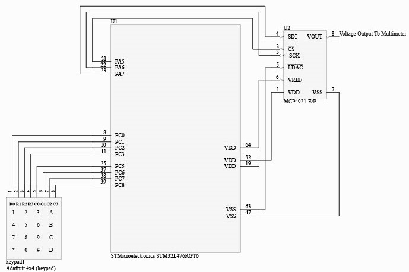

# Function-Generator

# Project Introduction
This project aims to design a function generator by integrating a DAC(MCP 4921 E/P), a 4 X 4 keyboard, and the MCU STM32L476. The function generator could generate 4 different function waveforms, which include sine wave, triangle wave, sawtooth wave, and square wave. The Function Generator could display five different frequencies: 100 Hz, 200Hz, 300Hz, 400Hz, 500Hz for each waveform, and could also adjust the duty cycle of the square wave from 10% through 90% with an interval of 10%.   
All the functions of the function generator are controlled by the 4 X 4 keypad. While pressing 6, 7, 8, and 9 it will generate sine waves, triangle waves, sawtooth waves, and square waves. Pressing 1, 2, 3, 4, and 5 will adjust the frequency of the wave from 100 Hz to 500Hz. Pressing * and # will decrease and increase the duty cycle of the square wave and pressing 0 will reset the duty cycle to the default duty cycle. 
The waveform is generated through outputting different voltages(0V ~ 3V) on the oscilloscope by digital to analog converter(DAC). 

# Table of Contents
* [Accomplishments](#accomplishments)
* [System Specification](#system-specification)
* [Schematic](#schematic)
* [How the code works?](https://github.com/ElvisTang123/Function-Generator/blob/main/Program%20Files/README.md)

# Accomplishments
* Configured the GPIO pins and SPI to enable STM32 to transmit data with DAC through SPI.
* Created lookup tables for each waveform and configured the timer to generate interrupts so that the DAC can output a specific voltage from lookup tables during each interrupt.
* Utilized global flags and switch statements controlled by the keypad to select a specific lookup table and further adjust the function waveforms, frequencies, and duty cycles that are displayed on the oscilloscope.

# System Specification
It can be seen from the below specifications of the LCD module that the size of the LCD monitor we used for the lockbox is sufficient, and the color contrast is very good. It can not only display the instructions clearly but also have enough space to key in the pins. The power requirement is 3.3V, which is basically very low, so we can use a very small power supply to drive the LCD.  

| Wave Form | Sin wave, Triangle Wave, Sawtooth Wave, Square Wave|
| :-----------:  | :-----------: |
| Frequency  Range| 100Hz, 200Hz, 300Hz, 400Hz, 500Hz |
| Duty Cycle |From 10% to 90%(only for square wave)|
| Max Resolution | 349040 samples/seconds |
| Power Supply | 3.3V |
| DAC| MCP 4921 E/P |
| High Volts(output) |3V|
| Low Volts(output) | 0V |
| Control Panel | Adafruit 4 X 4 Keypad |

# Schematic

  

